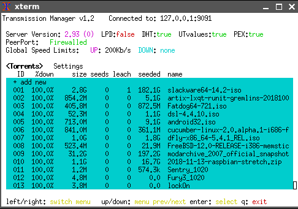

SYNOPSIS
========

transbt_mgr.lua is a text-mode (both menus and command-line) lua program for managing a transmission bittorrent daemon. It requires libUseful (at least version 4.0) and libUseful-lua (at least version 2.18) to be installed. 

LICENSE
=======

transbt_mgr.lua is released under version 3 of the GNU PUBLIC LICENSE. 

USAGE
=====

If you do not have binfmt_misc set up for lua, you will have to run this as 'lua transbt_mgr.lua', or maybe 'lua5.3 transbt_mgr.lua'


```
transbt_mgr.lua                  - with no arguments interactive menu mode is activated
transbt_mgr.lua list             - output a list of torrents
transbt_mgr.lua add [url]        - add a torrent (multiple urls can be passed to add mutliple torrents)
transbt_mgr.lua del [id]         - delete torrent using the torrent's id number (multiple ids can be passed to delete mutliple torrents)
transbt_mgr.lua clear            - DELETES ALL TORRENTS! use with care!
transbt_mgr.lua start [id]       - start a stopped/paused torrent using the torrent's id number (multiple ids can be passed)
transbt_mgr.lua stop [id]        - stop/pause a torrent using the torrent's id number (multiple ids can be passed)
```

The program defaults to connecting to a transmission daemon on port 9091 on localhost (127.0.0.1). Other hosts can be specified by including a host:port specifier on the command line, like this:

```
transbt_mgr.lua localhost:4444 list
transbt_mgr.lua myserver.test.site:9091 del 5 8
transbt_mgr.lua 192.168.2.1:9091

```

COLORS
======

If the default colors aren't to your liking you can change most of them in the lua script by changing the 'tilde specifiers' in the `Out:puts()` statements. The following specifiers are recognized:

```
~e   emphasis/bold text
~w   white foreground
~W   white background
~n   black (noir) foreground
~N   black (noir) background
~b   blue foreground
~B   blue background
~c   cyan foreground
~C   cyan background
~m   magenta foreground
~M   magenta background
~y   yellow foreground
~Y   yellow background
~r   red foreground
~R   red background
~g   green foreground
~G   green background
~0   reset to default colors
~>   clear to end of line
```


SCREENSHOT
==========


